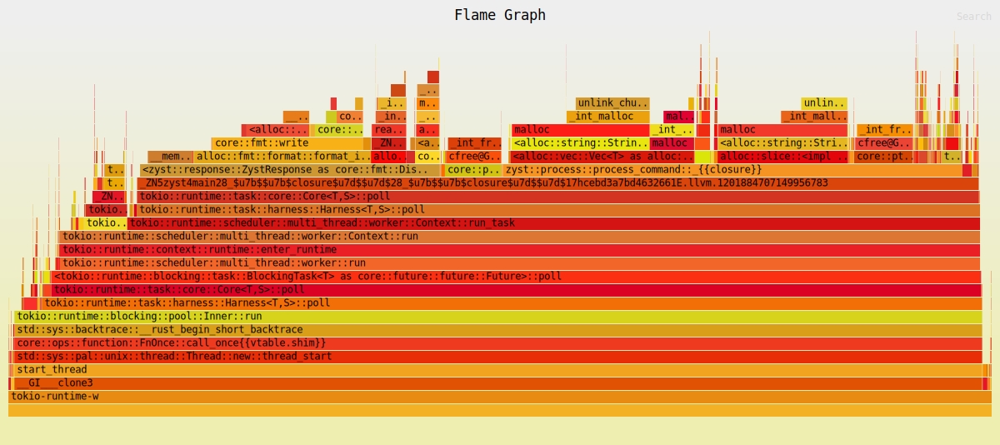

# 🐆 Zyst

 [](https://github.com/bourdeau/zyst/actions) [](https://deps.rs/repo/github/bourdeau/zyst)

Zyst is a Redis-compatible server reimplemented from scratch in Rust. It aims to provide a in-memory key-value store while leveraging Rust’s safety and concurrency features. Zyst is only supported on Linux.

I make this project for **fun**, it doesn't aim to replace Redis. For now, I am focusing on implementing common Redis functionalities rather than on performance.



## Setup

Run the zyst server:

```bash
cargo build --release
./target/release/zyst
```
In another terminal:

```
redis-cli
SET first_name John
```

## Features

`Zyst` implements a basic `Append-Only File (AOF)` system. `AOF` persistence logs every write operation received by the server, allowing these operations to be replayed during startup to restore the original dataset.

### Commands

#### Key-Value Storage

| Command  | Syntax | Example | Output | Done |
|----------|--------|---------|--------|------|
| **SET**  | `SET key value` | `SET user:1 "John"` | `OK` | ✅ |
| **GET**  | `GET key` | `GET user:1` | `"John"` | ✅ |
| **DEL**  | `DEL key` | `DEL user:1` | `1` (if key existed) | ✅ |
| **EXISTS** | `EXISTS key` | `EXISTS user:1` | `1` (exists) / `0` (not) | ✅ |


#### Expiration & Time-to-Live

**Note:** expired keys are deleted by calling `GET` or by a background task every 60 seconds.

| Command  | Syntax | Example | Output | Done |
|----------|--------|---------|--------|------|
| **EXPIRE** | `EXPIRE key seconds` | `EXPIRE user:1 3600` | `1` (success) | ✅ |
| **TTL**  | `TTL key` | `TTL user:1` | `3599` (seconds left) | ✅ |


#### Counters & Rate Limiting

| Command  | Syntax | Example | Output | Done |
|----------|--------|---------|--------|------|
| **INCR**  | `INCR key` | `INCR api:requests` | `1`, `2`, `3`... | ✅ |
| **DECR**  | `DECR key` | `DECR api:requests` | `2`, `1`, `0`... | ✅ |
| **INCRBY** | `INCRBY key amount` | `INCRBY api:requests 5` | `5`, `10`, `15`... | ✅ |


#### Lists

| Command  | Syntax | Example | Output | Done |
|----------|--------|---------|--------|------|
| **LPUSH** | `LPUSH key values` | `LPUSH queue task1 task2 task3` | `1` (new length) | ✅ |
| **LRANGE** | `LRANGE key start stop` | `LRANGE queue 0 -1` | `2` (new length) | ✅ |
| **RPUSH** | `RPUSH key value` | `RPUSH queue "task2"` | `2` (new length) | ✅ |
| **LPOP**  | `LPOP key` | `LPOP queue` | `"task1"` | ✅ |
| **RPOP**  | `RPOP key` | `RPOP queue` | `"task2"` | ✅ |


#### Hashes

| Command  | Syntax | Example | Output | Done |
|----------|--------|---------|--------|------|
| **HSET**  | `HSET key field value` | `HSET user:1 name "Alice"` | `1` | ✅ |
| **HGET**  | `HGET key field` | `HGET user:1 name` | `"Alice"` | ✅ |
| **HDEL**  | `HDEL key field` | `HDEL user:1 name` | `1` | ✅ |
| **HGETALL** | `HGETALL key` | `HGETALL user:1` | `["name", "Alice"]` | ✅ |


#### Sets

| Command  | Syntax | Example | Output | Done |
|----------|--------|---------|--------|------|
| **SADD**  | `SADD key value` | `SADD online_users "user1"` | `1` | ✅ |
| **SREM**  | `SREM key value` | `SREM online_users "user1"` | `1` | ✅ |
| **SMEMBERS** | `SMEMBERS key` | `SMEMBERS online_users` | `["user2", "user3"]` | ✅ |


#### Miscellaneous

| Command  | Syntax | Example | Output | Done |
|----------|--------|---------|--------|------|
| **FLUSHDB** | `FLUSHDB` | `FLUSHDB` | `OK` | ✅ |
| **FLUSHALL** | `FLUSHALL` | `FLUSHALL` | `OK` |   |
| **KEYS** | `KEYS pattern` | `KEYS user:*` | `["user:1", "user:2"]` | ✅ |


## Benchmark

On average, Zyst is 15% slower than Redis, which came as a surprise, as I was expecting much worse performance conzysting I almost didn't make any optimizations.

On my machine:
```
OS: NixOS 24.11 (Vicuna)
KERNEL: 6.6.74 
CPU: AMD Ryzen 7 9700X 8-Core
RAM: 31 GB
```

*Redis 7.2.7:*

```
➜ redis-benchmark -t set,get,incr,lpush,rpush,lpop,rpop,hset,lpush,lrange_100,lrqnge_300,lrange_500,lrange_600 -n 100000 -q
SET: 306748.47 requests per second, p50=0.087 msec
GET: 367647.03 requests per second, p50=0.071 msec
INCR: 367647.03 requests per second, p50=0.071 msec
LPUSH: 369003.69 requests per second, p50=0.071 msec
RPUSH: 369003.69 requests per second, p50=0.071 msec
LPOP: 371747.22 requests per second, p50=0.071 msec
RPOP: 373134.31 requests per second, p50=0.071 msec
HSET: 371747.22 requests per second, p50=0.071 msec
LPUSH (needed to benchmark LRANGE): 374531.84 requests per second, p50=0.071 msec
LRANGE_100 (first 100 elements): 232018.56 requests per second, p50=0.111 msec
LRANGE_500 (first 500 elements): 69832.40 requests per second, p50=0.359 msec
LRANGE_600 (first 600 elements): 59594.76 requests per second, p50=0.415 msec
```

*Zyst 0.6.0:*

```
redis-benchmark -t set,get,incr,lpush,rpush,lpop,rpop,hset,lpush,lrange_100,lrqnge_300,lrange_500,lrange_600 -n 100000 -q
SET: 264550.28 requests per second, p50=0.103 msec
GET: 349650.34 requests per second, p50=0.079 msec
INCR: 307692.31 requests per second, p50=0.087 msec
LPUSH: 304878.03 requests per second, p50=0.087 msec
RPUSH: 303951.38 requests per second, p50=0.087 msec
LPOP: 306748.47 requests per second, p50=0.087 msec
RPOP: 292397.66 requests per second, p50=0.087 msec
HSET: 304878.03 requests per second, p50=0.087 msec
LPUSH (needed to benchmark LRANGE): 303030.28 requests per second, p50=0.087 msec
LRANGE_100 (first 100 elements): 205761.31 requests per second, p50=0.127 msec
LRANGE_500 (first 500 elements): 63211.12 requests per second, p50=0.423 msec
LRANGE_600 (first 600 elements): 54229.93 requests per second, p50=0.495 msec
```
